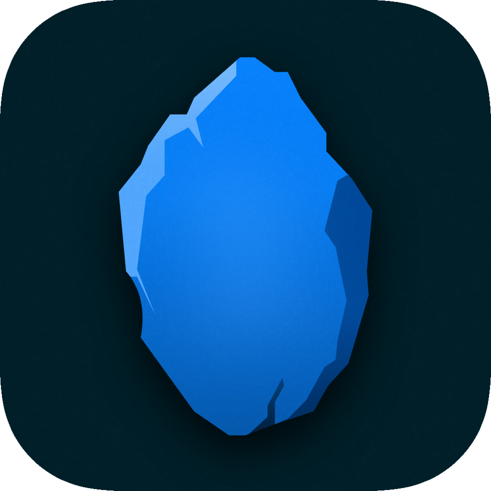

### 👋 Welcome to Runestone - a performant plain text editor for iOS with code editing features

Runestone uses GitHub's [Tree-sitter](https://tree-sitter.github.io/tree-sitter/) to parse code to a syntax tree which is used for features that require an understanding of the code in the editor, for example syntax highlighting.

[](https://swiftpackageindex.com/simonbs/Runestone)
[](https://swiftpackageindex.com/simonbs/Runestone)
[](https://github.com/simonbs/Runestone/actions/workflows/build_and_test.yml)
[](https://github.com/simonbs/Runestone/actions/workflows/build_documentation.yml)
[](https://github.com/simonbs/Runestone/actions/workflows/build_example_project.yml)
[](https://github.com/simonbs/Runestone/actions/workflows/codeql.yml)
[](https://github.com/simonbs/Runestone/actions/workflows/swiftlint.yml)
[](https://twitter.com/simonbs)
[](https://mastodon.social/@simonbs)

## ✨ Features

- Syntax highlighting.
- Line numbers.
- Highlight the selected line.
- Show invisible characters (tabs, spaces and line breaks).
- Insertion of character pairs, e.g. inserting the trailing quotation mark when inserting the leading.
- Customization of colors and fonts.
- Toggle line wrapping on and off.
- Adjust height of lines.
- Add a page guide.
- Add vertical and horizontal overscroll.
- Highlight ranges in the text view.
- Search the text using regular expressions.
- Automatically detects if a file is using spaces or tabs for indentation.
- Specify line endings (CR, LF, CRLF) to use when inserting a line break.
- Automatically detect line endings in a text.

## 🚀 Getting Started

Please refer to the [Getting Started](https://docs.runestone.app/documentation/runestone/gettingstarted) article in the documentation and the [Meet Runestone](https://docs.runestone.app/tutorials/meet-runestone) series of tutorials.

## 📖 Documentation

The documentation of all public types is available at [docs.runestone.app](https://docs.runestone.app). The documentation is generated from the Swift code using Apple's [DocC documentation compiler](https://developer.apple.com/documentation/docc).

## 🏎 Performance

Runestone was built to be fast. Its good performance is by far mostly thanks to Tree-sitter's incremental parsing and [AvalonEdit's approach for managing lines in a document](https://github.com/icsharpcode/AvalonEdit/blob/master/ICSharpCode.AvalonEdit/Document/DocumentLineTree.cs).

When judging the performance of Runestone, it is key to build your app in the release configuration. The optimizations applied by the compiler when using the release configuration becomes very apparent when opening large documents.

## 🖥 Catalyst

The project should mostly work with Catalyst on the Mac, however, it isn't fully tested and the implementation isn't considered done. The focus is currently on the iPhone and iPad.

## 📱 Projects

The Runestone framework is used by an app of the same name. The Runestone app is a plain text editor for iPhone and iPad that uses all the features of this framework.

<a href="https://apps.apple.com/us/app/runestone-editor/id1548193893" target="_blank"></a>

<a href="https://apps.apple.com/us/app/runestone-editor/id1548193893" target="_blank"></a>

## 👨‍💻 Contributing

Pull requests with bugfixes and new features are much appreciated. I'll be happy to review them and merge them once they're ready, as long as they contain change that fit within the vision of Runestone and provide generally useful functionality.

Clone the repository to get started working on the project. Note that Runestone depends on Tree-sitter through a submodule. This submodule must be cloned as well before Runestone can be built. Pass the `--recursive` option when cloning the repository to clone all submodules.

```bash
git clone --recursive git@github.com:simonbs/Runestone.git
```

## ❤️ Acknowledgments

- [Tree-sitter](https://tree-sitter.github.io/tree-sitter) is used to parse code incrementally.
- Line management is translated to Swift from [AvalonEdit](https://github.com/icsharpcode/AvalonEdit).
- [swift-tree-sitter](https://github.com/viktorstrate/swift-tree-sitter) and [SwiftTreeSitter](https://github.com/ChimeHQ/SwiftTreeSitter) which have served as inspiration for the Tree-sitter bindings.
- Detection of indent strategy inspired by [auto-detect-indentation](https://github.com/jtokoph/auto-detect-indentation).
- And last (but not least!), thanks a ton to [Alexander Blach](https://twitter.com/Lextar) (developer of [Textastic](https://www.textasticapp.com)), [Till Konitzer](https://twitter.com/knutknatter) (developer of [Essayist](https://www.essayist.app)), [Greg Pierce](https://twitter.com/agiletortoise) (developer of [Drafts](https://getdrafts.com)) and [Max Brunsfeld](https://twitter.com/maxbrunsfeld) (developer of [Tree-sitter](https://tree-sitter.github.io/tree-sitter/)) for pointing me in the right direction when I got stuck.
